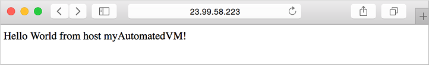
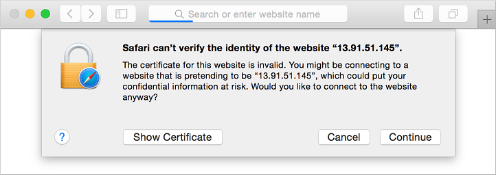
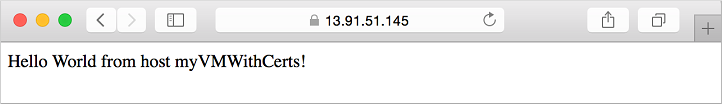

# linux-vm-with-cloud-init
### Applies to: ✔️ Linux VMs ✔️ Flexible scale sets

This guide is to customize a linux VM on first boot by using cloud-init, you will create:

1. Create a cloud-init config file
2. Create a VM that uses a cloud-init file
3. View a running Node.js app after the VM is created
4. Use Key Vault to securely store certificates
5. Automate secure deployments of NGINX with cloud-init


If you choose to install and use the CLI locally, this tutorial requires that you are running the Azure CLI version 2.0.30 or later. Run az --version to find the version. If you need to install or upgrade, see this [link](https://learn.microsoft.com/en-us/azure/virtual-machines/linux/tutorial-automate-vm-deployment#:~:text=or%20upgrade%2C%20see-,Install%20Azure%20CLI,-.).

### Cloud-init overview
Cloud-init is a widely used approach to customize a Linux VM as it boots for the first time. You can use cloud-init to install packages and write files, or to configure users and security. As cloud-init runs during the initial boot process, there are no additional steps or required agents to apply your configuration.

Cloud-init also works across distributions. For example, you don't use apt-get install or yum install to install a package. Instead you can define a list of packages to install. Cloud-init automatically uses the native package management tool for the distro you select.

For detailed information cloud-init support for each distribution, see this [link](https://learn.microsoft.com/en-us/azure/virtual-machines/linux/tutorial-automate-vm-deployment#:~:text=Cloud%2Dinit%20support%20for%20VMs%20in%20Azure)

### Create cloud-init config file
To see cloud-init in action, create a VM that installs NGINX and runs a simple 'Hello World' Node.js app. The following cloud-init configuration installs the required packages, creates a Node.js app, then initialize and starts the app.

At your bash prompt or in the Cloud Shell, create a file named cloud-init.txt and paste the following configuration:

```yaml
#cloud-config
package_upgrade: true
packages:
  - nginx
  - nodejs
  - npm
write_files:
  - owner: www-data:www-data
    path: /etc/nginx/sites-available/default
    defer: true
    content: |
      server {
        listen 80;
        location / {
          proxy_pass http://localhost:3000;
          proxy_http_version 1.1;
          proxy_set_header Upgrade $http_upgrade;
          proxy_set_header Connection keep-alive;
          proxy_set_header Host $host;
          proxy_cache_bypass $http_upgrade;
        }
      }
  - owner: azureuser:azureuser
    path: /home/azureuser/myapp/index.js
    defer: true
    content: |
      var express = require('express')
      var app = express()
      var os = require('os');
      app.get('/', function (req, res) {
        res.send('Hello World from host ' + os.hostname() + '!')
      })
      app.listen(3000, function () {
        console.log('Hello world app listening on port 3000!')
      })
runcmd:
  - service nginx restart
  - cd "/home/azureuser/myapp"
  - npm init
  - npm install express -y
  - nodejs index.js
  ```

For more information about cloud-init configuration options, see these [examples](https://cloudinit.readthedocs.io/en/latest/topics/examples.html).

### Create virtual machine
Before you can create a VM, login to Azure using ```az login``` on the terminal then create a resource group with this command ```az group create.```

The following example creates a resource group named myResourceGroupAutomate in the uksouth location:

```bash
az group create --name myResourceGroupAutomate --location uksouth
```
Now create a VM with az vm create. Use the --custom-data parameter to pass in your cloud-init config file. Provide the full path to the cloud-init.txt config if you saved the file outside of your present working directory. The following example creates a VM named myVM:
  
  ```bash
az vm create --resource-group myResourceGroupAutomate --name myAutomatedVM --image Ubuntu2204 --admin-username azureuser --generate-ssh-keys --custom-data cloud-init.txt
```

It takes a few minutes for the VM to be created, the packages to install, and the app to start.
There are background tasks that continue to run after the Azure CLI returns you to the prompt. It may be another couple of minutes before you can access the app. When the VM has been created, take note of the ```publicIpAddress``` displayed by the Azure CLI. You can also get the this in the overview page of the VM in the Azure Portal.
This address is used to access the Node.js app via a web browser.

To allow web traffic to reach your VM, open port 80 from the Internet with this:
```bash
az vm open-port --port 80 --resource-group myResourceGroupAutomate --name myAutomatedVM
```
### Test web app.

Now you can open a web browser and enter ```http://<publicIpAddress>``` in the address bar.
Provide your own public IP address from the VM create process. Your Node.js app is displayed as shown in the following example:




# SEURE THE NGINIX APP WITH CERTIFICATES FROM AZURE KEY VAULT

### Inject certificates from Key Vault:
This optional section shows how you can securely store certificates in Azure Key Vault and inject them during the VM deployment. Rather than using a custom image that includes the certificates baked-in, this process ensures that the most up-to-date certificates are injected to a VM on first boot. During the process, the certificate never leaves the Azure platform or is exposed in a script, command-line history, or template.

Azure Key Vault safeguards cryptographic keys and secrets, such as certificates or passwords. Key Vault helps streamline the key management process and enables you to maintain control of keys that access and encrypt your data. This scenario introduces some Key Vault concepts to create and use a certificate, though is not an exhaustive overview on how to use Key Vault.

See the followintg steps to inject certificates from Key Vault:

1. Create an Azure Key Vault
2. Generate or upload a certificate to the Key Vault
3. Create a secret from the certificate to inject in to a VM
4. Create a VM and inject the certificate

First, create a Key Vault with az keyvault create and enable it for use when you deploy a VM. Each Key Vault requires a unique name, and should be all lower case. Replace mykeyvault in the following example with your own unique Key Vault name:
```bash
keyvault_name=mykeyvault
az keyvault create \
    --resource-group myResourceGroupAutomate \
    --name $keyvault_name \
    --enabled-for-deployment
```
### Generate certificate and store in Key Vault
For production use, you should import a valid certificate signed by trusted provider with az keyvault certificate import.
For this tutorial, the following example shows how you can generate a self-signed certificate with az keyvault certificate create that uses the default certificate policy:
```bash
az keyvault certificate create \
    --vault-name $keyvault_name \
    --name mycert \
    --policy "$(az keyvault certificate get-default-policy --output json)"
```
### Prepare certificate for use with VM
To use the certificate during the VM create process, obtain the ID of your certificate with az keyvault secret list-versions. The VM needs the certificate in a certain format to inject it on boot, so convert the certificate with az vm secret format. The following example assigns the output of these commands to variables for ease of use in the next steps:
  ```bash
secret=$(az keyvault secret list-versions \
          --vault-name $keyvault_name \
          --name mycert \
          --query "[?attributes.enabled].id" --output tsv)
vm_secret=$(az vm secret format --secret "$secret" --output json)
```

### Create cloud-init config to secure NGINX
Paste the folllowing into the cloud-init.txt file 
```bash

package_upgrade: true
packages:
  - nginx
  - nodejs
  - npm
write_files:
  - owner: www-data:www-data
    path: /etc/nginx/sites-available/default
    defer: true
    content: |
      server {
        listen 80;
        listen 443 ssl;
        ssl_certificate /etc/nginx/ssl/mycert.cert;
        ssl_certificate_key /etc/nginx/ssl/mycert.prv;
        location / {
          proxy_pass http://localhost:3000;
          proxy_http_version 1.1;
          proxy_set_header Upgrade $http_upgrade;
          proxy_set_header Connection keep-alive;
          proxy_set_header Host $host;
          proxy_cache_bypass $http_upgrade;
        }
      }
  - owner: azureuser:azureuser
    path: /home/azureuser/myapp/index.js
    defer: true
    content: |
      var express = require('express')
      var app = express()
      var os = require('os');
      app.get('/', function (req, res) {
        res.send('Hello World from host ' + os.hostname() + '!')
      })
      app.listen(3000, function () {
        console.log('Hello world app listening on port 3000!')
      })
runcmd:
  - secretsname=$(find /var/lib/waagent/ -name "*.prv" | cut -c -57)
  - mkdir /etc/nginx/ssl
  - cp $secretsname.crt /etc/nginx/ssl/mycert.cert
  - cp $secretsname.prv /etc/nginx/ssl/mycert.prv
  - service nginx restart
  - cd "/home/azureuser/myapp"
  - npm init
  - npm install express -y
  - nodejs index.js
```
### Create secure VM
Now create a VM with az vm create. The certificate data is injected from Key Vault with the --secrets parameter. As in the previous example, you also pass in the cloud-init config with the --custom-data parameter:
```bash
az vm create \
    --resource-group myResourceGroupAutomate \
    --name myVMWithCerts \
    --image Ubuntu2204 \
    --admin-username azureuser \
    --generate-ssh-keys \
    --custom-data cloud-init-secured.txt \
    --secrets "$vm_secret"
```
It takes a few minutes for the VM to be created, the packages to install, and the app to start. There are background tasks that continue to run after the Azure CLI returns you to the prompt. It may be another couple of minutes before you can access the app. When the VM has been created, take note of the publicIpAddress displayed by the Azure CLI. This address is used to access the Node.js app via a web browser.

To allow secure web traffic to reach your VM, open port 443 from the Internet with az vm open-port:
```bash
az vm open-port \
    --resource-group myResourceGroupAutomate \
    --name myVMWithCerts \
    --port 443
```
#### Test secure web app:
Now you can open a web browser and enter https://<publicIpAddress> in the address bar. Provide your own public IP address as shown in the output of the previous VM create process. Accept the security warning if you used a self-signed certificate:

Accept web browser security warning


Your secured NGINX site and Node.js app is then displayed as in the following:


# CLEAN UP RESOURCES
When no longer needed, you can use the az group delete command to remove the resource group, VM, and all related resources. The following example removes the myResourceGroupAutomate resource group and all resources within it:
```bash
az group delete --name myResourceGroupAutomate --yes --no-wait
```

# References
- [Tutorial - How to use cloud-init to customize a Linux virtual machine in Azure on first boot](https://learn.microsoft.com/en-us/azure/virtual-machines/linux/tutorial-automate-vm-deployment?toc=%2Fazure%2Fvirtual-machines%2Flinux%2Ftoc.json&bc=%2Fazure%2Fvirtual-machines%2Flinux%2Fbreadcrumb%2Ftoc.json&view=azure-cli-latest)

- [Install Azurre CLI](https://learn.microsoft.com/en-us/cli/azure/install-azure-cli)

- 